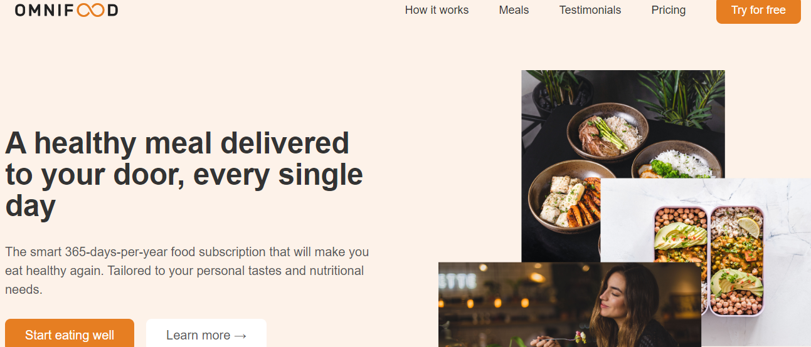

# Omnifood Project

## Project Overview
The Omnifood project is an AI-powered food subscription service designed to provide users with personalized meal plans tailored to their dietary preferences and nutritional needs.

## Technologies Used
- **HTML**: For structuring the web page.
- **CSS**: For styling the web page, including responsive design and media queries.
- **JavaScript**: For adding interactivity to the web page, including mobile navigation and other dynamic features.
- **Chrome Developer Tools**: For debugging and testing the web application, ensuring cross-browser compatibility, and optimizing performance.

## Features Implemented

### Header Section
- Includes a logo and a navigation menu with links to different sections of the page.
- A mobile navigation button to toggle the menu on smaller screens.

### Hero Section
- A prominent introductory section with a primary heading, description, and call-to-action buttons.
- Displays images of happy customers and the number of meals delivered.

### Featured Section
- Highlights media outlets that have featured Omnifood, adding credibility to the service.

### How It Works Section
- Explains the process of using Omnifood in three simple steps with corresponding images.

### Meals Section
- Showcases some of the meal options available through Omnifood, including nutritional information and ratings.
- Lists various diets supported by Omnifood.

### Testimonials Section
- Displays customer testimonials and images to build trust and showcase positive experiences.

### Gallery Section
- Features a gallery of beautifully arranged food images to entice potential customers.

### Pricing Section
- Provides information on the different pricing plans available for Omnifood subscribers.

## Lessons Learned

### Responsive Design
- Implementing responsive design techniques to ensure the website looks good on various devices and screen sizes using media queries.

### JavaScript Interactivity
- Enhancing user experience by adding interactivity with JavaScript, such as the mobile navigation menu.

### Image Optimization
- Learning the importance of optimizing images for the web to improve load times and performance.

### Accessibility
- Understanding the significance of making the website accessible to all users, including using alt attributes for images and ensuring keyboard navigability.

### Chrome Developer Tools
- **Inspecting Elements**: To view and edit HTML and CSS in real time.
- **Console**: For debugging JavaScript code.
- **Network**: To monitor network requests and optimize load times.
- **Performance**: To analyze and improve the performance of the web application.
- **Device Mode**: To test responsive designs on different devices and screen sizes.

## Response Techniques

### Event Handling
- Using JavaScript to handle events like clicks to toggle the mobile navigation menu.

### CSS Transitions
- Applying smooth transitions to elements for a better user experience.

### Grid Layouts
- Utilizing CSS Grid for creating flexible and responsive layouts.

### Flexbox
- Employing Flexbox for aligning items within containers, especially for the mobile navigation menu and testimonials section.
